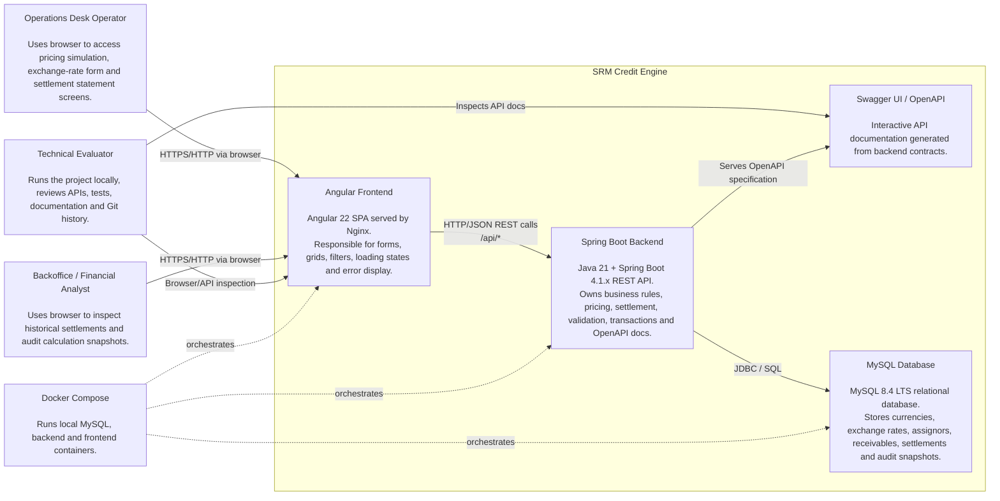
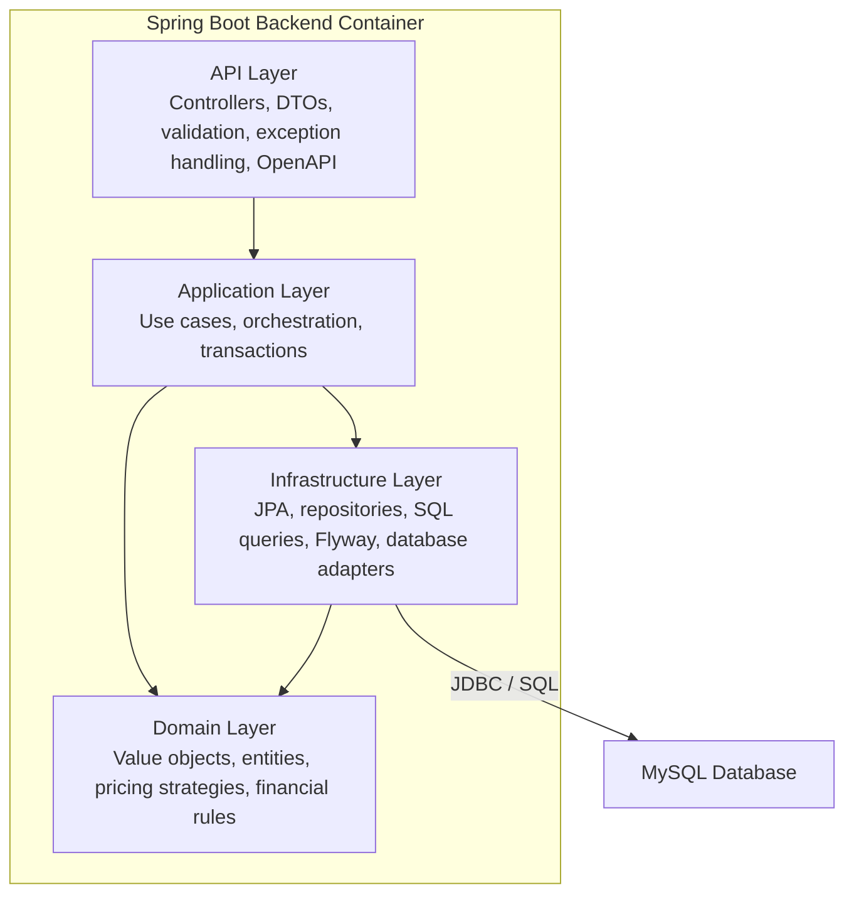
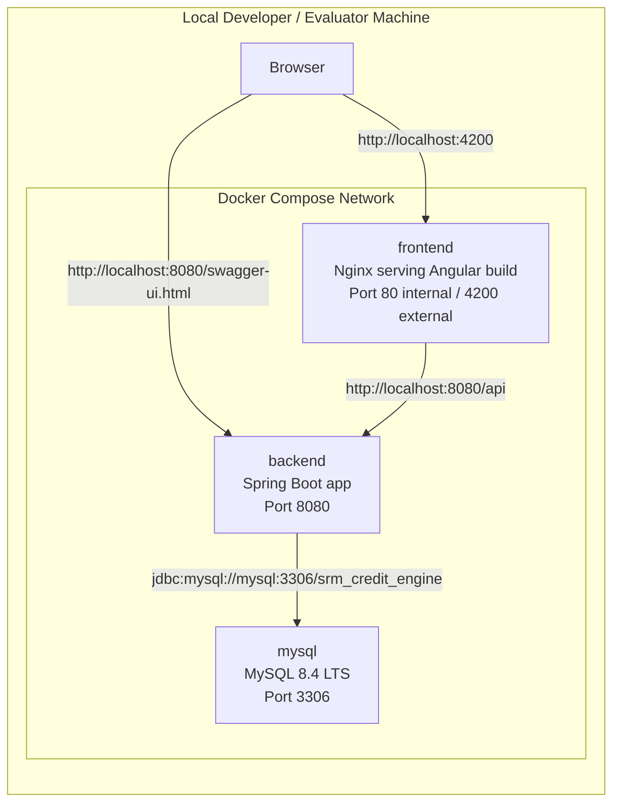

# C4 Container Diagram — SRM Credit Engine

## 1. Purpose

This document defines the C4 Container diagram for the **SRM Credit Engine**.

The container diagram shows the main runtime containers inside the system boundary and how they communicate.

This diagram must remain aligned with:

```text id="egcbqs"
docs/specs/04-api-contract.md
docs/specs/05-data-model.md
docs/specs/06-architecture.md
docs/adr/ADR-001-backend-stack.md
docs/adr/ADR-002-database-choice.md
docs/adr/ADR-004-architecture-style.md
docs/adr/ADR-005-frontend-stack.md
docker-compose.yml
```

## 2. Container Overview

The SRM Credit Engine is composed of three primary runtime containers:

```text id="ccam7b"
1. Angular Frontend
2. Spring Boot Backend
3. MySQL Database
```

Supporting runtime/documentation components:

```text id="ww1cq1"
OpenAPI / Swagger UI
Docker Compose
```

The backend is the official source for all financial calculations.

The frontend is responsible for user interaction and API consumption only.

## 3. Container Diagram



## 4. Runtime Containers

## 4.1 Angular Frontend

### Technology

```text id="ssfb2p"
Angular 22
TypeScript
Angular Material
Reactive Forms
Angular HttpClient
Signals + services
Nginx for production container runtime
```

### Responsibility

The frontend is responsible for:

* rendering the operator interface;
* collecting pricing simulation inputs;
* collecting exchange-rate inputs, if the UI includes that screen;
* displaying pricing simulation results;
* displaying settlement statement rows;
* applying UI-level validation;
* sending filters and pagination parameters to the backend;
* displaying backend validation and business errors;
* formatting monetary, date and status values for display.

### Must Not Do

The frontend must not:

```text id="hfj1sx"
- implement the official pricing formula;
- calculate official settlement values;
- hardcode exchange rates;
- hardcode spreads as source of truth;
- paginate settlement history locally after loading all records;
- bypass backend validation.
```

### Communication

The frontend communicates with the backend through:

```text id="0823ed"
HTTP/JSON
```

Expected base URL in local development:

```text id="nxlbf8"
http://localhost:8080/api
```

Expected Docker Compose external URL:

```text id="8gctgu"
http://localhost:8080/api
```

### Main API Calls

```text id="dadxfo"
GET  /api/reference-data/currencies
GET  /api/reference-data/receivable-types
POST /api/exchange-rates
GET  /api/exchange-rates/latest
POST /api/pricing/simulations
POST /api/settlements
GET  /api/settlements/{id}
GET  /api/settlements/statement
```

## 4.2 Spring Boot Backend

### Technology

```text id="qnb6k3"
Java 21
Spring Boot 4.1.x
Spring Web
Spring Validation
Spring Data JPA / Hibernate
Flyway
MySQL JDBC Driver
OpenAPI / Swagger
JUnit 5
Mockito
AssertJ
Testcontainers
```

### Responsibility

The backend is responsible for:

* REST API exposure;
* input validation;
* structured error handling;
* exchange-rate registration and lookup;
* pricing simulation;
* Strategy Pattern implementation for receivable risk rules;
* BigDecimal-based financial calculation;
* cross-currency conversion;
* settlement batch processing;
* ACID transaction boundaries;
* duplicate settlement prevention;
* settlement item audit snapshot persistence;
* settlement statement query with database-level filtering;
* OpenAPI documentation.

### Internal Layering

The backend is organized into:

```text id="tm7bb2"
api
application
domain
infrastructure
```

## 4.2.1 API Layer

Responsibilities:

```text id="m7rfjv"
- REST controllers
- request DTOs
- response DTOs
- validation annotations
- OpenAPI annotations
- global exception handling
- API-specific mapping
```

Examples:

```text id="xcbd1r"
ReferenceDataController
ExchangeRateController
PricingSimulationController
SettlementController
SettlementStatementController
GlobalExceptionHandler
```

Must not contain:

```text id="6d9xix"
- pricing formula
- spread selection
- currency conversion logic
- settlement transaction orchestration
- SQL queries
```

## 4.2.2 Application Layer

Responsibilities:

```text id="ez2t42"
- use case orchestration
- transaction boundaries
- application-level validation
- repository coordination
- command/query handling
- coordination between domain and infrastructure
```

Examples:

```text id="vtoqpm"
CreateExchangeRateService
GetLatestExchangeRateService
PricingSimulationService
CreateSettlementService
GetSettlementService
SettlementStatementService
ListReferenceDataService
```

Critical transaction boundary:

```text id="n6o7sx"
CreateSettlementService
```

## 4.2.3 Domain Layer

Responsibilities:

```text id="0v5js9"
- entities
- value objects
- pricing strategies
- domain services
- business rules
- domain exceptions
- financial calculation logic
```

Examples:

```text id="qbde9h"
Money
Rate
Term
CurrencyCode
Receivable
Settlement
SettlementItem
ExchangeRate
PricingStrategy
MercantileDuplicatePricingStrategy
PostDatedCheckPricingStrategy
PricingStrategyResolver
PricingEngine
CurrencyConversionService
FinancialMath
```

Critical rules:

```text id="h1dyd0"
- use BigDecimal for financial calculations;
- do not use double or float for money/rates;
- apply cross-currency conversion after present value calculation;
- persist exchange-rate snapshots in settlement items;
- do not depend on HTTP or database details.
```

## 4.2.4 Infrastructure Layer

Responsibilities:

```text id="fpkt5a"
- JPA entities
- Spring Data repositories
- SQL projections
- native queries when needed
- Flyway migrations
- database configuration
- technical adapters
```

Examples:

```text id="y31xzl"
JpaExchangeRateRepository
JpaReceivableRepository
JpaSettlementRepository
SettlementStatementQueryRepository
ReferenceDataRepository
```

Statement query rule:

```text id="u5tn09"
Settlement statement filtering and pagination must happen in the database.
```

## 4.3 MySQL Database

### Technology

```text id="mvi5db"
MySQL 8.4 LTS
InnoDB
Flyway-managed schema
DECIMAL financial columns
UTC timestamps
```

### Responsibility

The database stores:

```text id="bq6kwu"
currencies
receivable_types
assignors
exchange_rates
receivables
settlements
settlement_items
```

### Critical Responsibilities

The database supports:

* relational integrity;
* ACID transactions;
* duplicate settlement prevention;
* settlement auditability;
* exchange-rate history;
* analytical statement queries;
* schema reproducibility through Flyway.

### Important Constraints

```text id="o5qw5r"
- settlement_items.receivable_id is unique;
- exchange_rates.rate must be positive;
- receivables.face_value must be positive;
- settlement item financial values must use DECIMAL;
- source and target currencies in exchange_rates must differ;
- receivables external reference is unique per assignor.
```

### Important Indexes

Indexes must support:

```text id="f73nee"
- exchange-rate latest lookup;
- settlement period filter;
- assignor filter;
- payment currency filter;
- source currency filter;
- receivable type filter;
- statement pagination and sorting.
```

## 4.4 Swagger UI / OpenAPI

### Technology

```text id="s7feg6"
Springdoc OpenAPI
Swagger UI
```

### Responsibility

Swagger/OpenAPI provides:

* interactive API documentation;
* request schema visibility;
* response schema visibility;
* endpoint discovery;
* manual evaluator testing;
* backend/frontend contract support.

Expected local URLs:

```text id="l2ythy"
http://localhost:8080/swagger-ui.html
http://localhost:8080/v3/api-docs
```

or equivalent Springdoc paths.

## 4.5 Docker Compose

### Technology

```text id="316wb1"
Docker Compose
```

### Responsibility

Docker Compose orchestrates local containers:

```text id="36zq5t"
mysql
backend
frontend
```

Expected command:

```bash id="f6dse7"
docker compose up --build
```

Expected ports:

```text id="sailgi"
Frontend: http://localhost:4200
Backend:  http://localhost:8080
MySQL:    localhost:3306
```

## 5. Container Communication

## 5.1 Browser to Frontend

```text id="z6x8io"
User browser -> Angular Frontend
```

Protocol:

```text id="4xm1m5"
HTTP
```

Local URL:

```text id="iio25u"
http://localhost:4200
```

## 5.2 Frontend to Backend

```text id="8mumzb"
Angular Frontend -> Spring Boot Backend
```

Protocol:

```text id="i6wuoz"
HTTP/JSON
```

Base path:

```text id="xqu3tv"
/api
```

CORS:

```text id="7gw5y1"
Backend must allow http://localhost:4200 through explicit configuration.
```

## 5.3 Backend to Database

```text id="6yyqop"
Spring Boot Backend -> MySQL Database
```

Protocol:

```text id="7k3gtz"
JDBC
```

Docker internal host:

```text id="bua40s"
mysql
```

Example JDBC URL:

```text id="6gabd7"
jdbc:mysql://mysql:3306/srm_credit_engine?useSSL=false&allowPublicKeyRetrieval=true&serverTimezone=UTC
```

## 5.4 Backend to Swagger UI

Swagger UI is served by the backend.

```text id="35gyue"
Evaluator browser -> Spring Boot Backend -> Swagger UI
```

## 6. Backend Component View

The backend container internally follows this structure:



## 7. Main Runtime Flows

## 7.1 Pricing Simulation

```text id="jg8joa"
Browser
  -> Angular Frontend
  -> POST /api/pricing/simulations
  -> PricingSimulationController
  -> PricingSimulationService
  -> PricingEngine
  -> PricingStrategyResolver
  -> CurrencyConversionService, if needed
  -> PricingSimulationResponse
  -> Angular result panel
```

Rules:

```text id="97b622"
- simulation is non-persistent;
- backend owns calculation;
- frontend displays backend result;
- cross-currency conversion happens after present value calculation.
```

## 7.2 Exchange Rate Registration

```text id="9u7ydz"
Browser or Swagger
  -> POST /api/exchange-rates
  -> ExchangeRateController
  -> CreateExchangeRateService
  -> ExchangeRateRepository
  -> MySQL exchange_rates table
```

Rules:

```text id="xg81jl"
- rate must be positive;
- source and target currencies must differ;
- direction is explicit;
- inverse rate is not inferred silently.
```

## 7.3 Settlement Creation

```text id="8tu0rr"
Browser or Swagger
  -> POST /api/settlements
  -> SettlementController
  -> CreateSettlementService @Transactional
  -> AssignorRepository
  -> ReceivableRepository
  -> ExchangeRateRepository
  -> PricingEngine
  -> SettlementRepository
  -> MySQL transaction
```

Rules:

```text id="1tv6r3"
- settlement is atomic;
- no partial persistence;
- duplicate settlement is prevented;
- receivable status is updated;
- calculation snapshots are persisted.
```

## 7.4 Settlement Statement Query

```text id="eyr9ny"
Browser
  -> Angular settlement grid
  -> GET /api/settlements/statement
  -> SettlementStatementController
  -> SettlementStatementService
  -> SettlementStatementQueryRepository
  -> MySQL filtered paginated query
  -> Paginated response
```

Rules:

```text id="6jvwfl"
- filtering happens in the database;
- pagination happens in the database;
- sorting is deterministic;
- frontend does not paginate locally.
```

## 8. Deployment View

Initial deployment is local-only.



## 9. Configuration

## 9.1 Backend Configuration

Backend configuration is environment-driven.

Expected variables:

```text id="5be3w5"
SPRING_PROFILES_ACTIVE
SPRING_DATASOURCE_URL
SPRING_DATASOURCE_USERNAME
SPRING_DATASOURCE_PASSWORD
SPRING_JPA_HIBERNATE_DDL_AUTO
SPRING_FLYWAY_ENABLED
SPRINGDOC_SWAGGER_UI_ENABLED
CORS_ALLOWED_ORIGINS
DEFAULT_BASE_RATE
SUPPORTED_CURRENCIES
```

## 9.2 Frontend Configuration

Expected variable:

```text id="9ygzal"
ANGULAR_API_BASE_URL
```

Local expected value:

```text id="71ir7c"
http://localhost:8080/api
```

## 9.3 Database Configuration

Expected variables:

```text id="nfw0zn"
MYSQL_DATABASE
MYSQL_ROOT_PASSWORD
MYSQL_USER
MYSQL_PASSWORD
MYSQL_PORT
```

No real secrets must be committed.

## 10. Container-Level Security Notes

Initial scope excludes authentication and authorization.

Still required:

```text id="uq4h76"
- backend validates all public inputs;
- backend returns structured errors;
- backend does not expose stack traces;
- CORS is explicit;
- no secrets are committed;
- SQL queries avoid unsafe string concatenation;
- logs do not expose credentials.
```

## 11. Container-Level Performance Notes

## 11.1 Backend

Expected behavior:

```text id="eqsroy"
- pricing calculation is CPU-light;
- settlement transaction is bounded by batch size;
- maximum settlement batch size is 100;
- statement queries use database-level filtering.
```

## 11.2 Database

Expected behavior:

```text id="otmom4"
- indexes support statement filters;
- exchange-rate latest lookup uses pair + valid_at index;
- duplicate settlement is prevented by unique constraint.
```

## 11.3 Frontend

Expected behavior:

```text id="feb5k5"
- statement grid uses server-side pagination;
- frontend does not load all records;
- frontend shows loading and error states.
```

## 12. Container-Level Testing Responsibilities

## 12.1 Frontend Container

Validated by:

```bash id="uwp3z5"
cd frontend
npm run build
```

Optional:

```bash id="l7q7lc"
cd frontend
npm test
```

## 12.2 Backend Container

Validated by:

```bash id="wdqevi"
cd backend
mvn test
```

Optional:

```bash id="r872hq"
cd backend
mvn verify
```

## 12.3 Database Container

Validated by:

```text id="c7t5zh"
- Flyway migration startup;
- schema validation;
- integration tests;
- manual database inspection if needed.
```

## 12.4 Full Stack

Validated by:

```bash id="dnzbug"
docker compose up --build
```

## 13. Design Constraints Reflected in the Diagram

The diagram reflects these constraints:

```text id="7ix5kz"
- Angular frontend is not the calculation authority.
- Spring Boot backend owns financial rules.
- MySQL stores audit snapshots.
- Docker Compose provides local reproducibility.
- Swagger documents backend APIs.
- No external FX provider is implemented.
- No real banking execution system is implemented.
- No authentication provider is implemented.
```

## 14. Out-of-Scope Containers

The following containers are intentionally not part of the initial delivery:

```text id="0e1lsl"
authentication service
authorization service
external exchange-rate provider
banking payment gateway
message broker
Kafka
Redis
data warehouse
monitoring stack
Prometheus
Grafana
Kubernetes
cloud load balancer
```

These may be future enhancements, but they are not required for the technical challenge delivery.

## 15. Future Container Enhancements

Possible future containers:

```text id="5l5u6y"
Auth Provider
Exchange Rate Provider Adapter
Message Broker
Outbox Processor
Read Replica
Observability Stack
API Gateway
Background Settlement Worker
```

These should be introduced only if future requirements justify additional operational complexity.

## 16. Validation Checklist

This container diagram is valid if:

```text id="dl6k2e"
[ ] Angular frontend container is represented.
[ ] Spring Boot backend container is represented.
[ ] MySQL database container is represented.
[ ] Swagger/OpenAPI is represented.
[ ] Docker Compose local orchestration is represented.
[ ] Frontend-to-backend communication is HTTP/JSON.
[ ] Backend-to-database communication is JDBC/SQL.
[ ] Backend owns financial calculation.
[ ] Frontend does not own financial calculation.
[ ] Diagram matches docker-compose.yml.
[ ] Diagram matches docs/specs/06-architecture.md.
```

## 17. Related Documents

```text id="crcu1i"
README.md
AGENTS.md
.env.example
docker-compose.yml
docs/specs/04-api-contract.md
docs/specs/05-data-model.md
docs/specs/06-architecture.md
docs/specs/08-acceptance-criteria.md
docs/adr/ADR-001-backend-stack.md
docs/adr/ADR-002-database-choice.md
docs/adr/ADR-004-architecture-style.md
docs/adr/ADR-005-frontend-stack.md
docs/diagrams/c4-context.md
```
