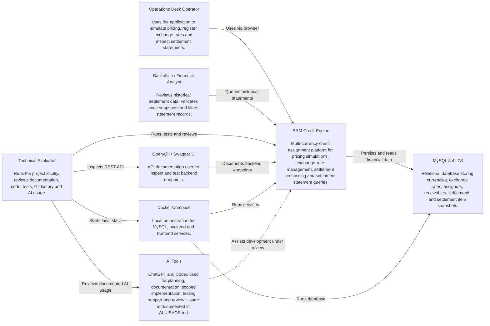

# C4 Context Diagram — SRM Credit Engine

## 1. Purpose

This document defines the C4 Context diagram for the **SRM Credit Engine**.

The context diagram shows the system boundary, primary users and external dependencies for the initial technical challenge delivery.

This diagram must remain aligned with:

```text
docs/specs/01-product-brief.md
docs/specs/04-api-contract.md
docs/specs/06-architecture.md
docs/adr/ADR-004-architecture-style.md
docs/adr/ADR-005-frontend-stack.md
```

## 2. System Context

The SRM Credit Engine is an internal financial operations system used to simulate, price and settle receivable batches in BRL and USD.

The system provides:

* exchange-rate management;
* pricing simulation;
* settlement batch processing;
* settlement statement queries;
* auditable calculation snapshots;
* operator-facing frontend;
* REST API documented through OpenAPI/Swagger.

The backend is the official source for financial calculations.

The frontend collects inputs and displays results, but it does not own the official pricing formula.

## 3. Context Diagram



## 4. C4 Context Elements

## 4.1 People

### Operations Desk Operator

Primary operational user of the application.

Responsibilities:

* register exchange rates;
* simulate receivable pricing;
* review calculated values;
* create settlement batches, if exposed through UI;
* inspect settlement statements.

Main interactions:

```text
Browser -> Angular Frontend -> Spring Boot Backend
```

### Backoffice / Financial Analyst

User responsible for reviewing historical settlement records.

Responsibilities:

* filter settlement statements;
* review settlement totals;
* inspect audit snapshots;
* verify exchange rates used in historical settlements;
* validate operational consistency.

Main interactions:

```text
Browser -> Angular Frontend -> Settlement Statement API
```

### Technical Evaluator

Reviewer of the technical challenge.

Responsibilities:

* run the project locally;
* inspect README and setup instructions;
* review architecture;
* inspect Git history;
* review tests;
* inspect AI usage;
* validate API behavior;
* validate frontend behavior.

Main interactions:

```text
Docker Compose
Swagger / OpenAPI
Git repository
Documentation
Application UI
```

## 4.2 Software System

### SRM Credit Engine

The main system being built.

Responsibilities:

* expose Angular frontend;
* expose REST API;
* manage exchange rates;
* simulate pricing;
* process settlement batches;
* persist auditable settlement records;
* query settlement statements;
* validate inputs;
* handle structured API errors;
* document APIs through OpenAPI.

System boundary includes:

```text
Angular frontend
Spring Boot backend
Application/domain logic
Persistence integration
OpenAPI documentation
Docker runtime configuration
```

System boundary excludes:

```text
real banking payment execution
real external exchange-rate provider
authentication and authorization
production cloud infrastructure
Kubernetes
external accounting systems
```

## 4.3 External Systems / Supporting Tools

### MySQL 8.4 LTS

Relational database used by the system.

Responsibilities:

* store currencies;
* store receivable types;
* store exchange rates;
* store assignors;
* store receivables;
* store settlements;
* store settlement item audit snapshots;
* enforce relational integrity;
* support analytical statement queries.

### OpenAPI / Swagger UI

Documentation and manual API exploration interface.

Responsibilities:

* expose API schema;
* document request and response DTOs;
* help evaluator test endpoints;
* support frontend/backend contract visibility.

### Docker Compose

Local orchestration tool.

Responsibilities:

* start MySQL;
* start backend;
* start frontend;
* provide reproducible local execution;
* simplify evaluator setup.

### AI Tools

AI tools used during development.

Examples:

```text
ChatGPT
Codex
```

Responsibilities:

* support planning;
* support specification writing;
* support scoped implementation;
* support test generation;
* support review;
* support documentation.

Rules:

* AI output is treated as draft;
* author reviews all generated work;
* material AI usage is documented in `AI_USAGE.md`;
* AI must not replace ownership of business logic or final code.

## 5. Main User Journeys

## 5.1 Pricing Simulation

```text
Operations Desk Operator
  -> SRM Credit Engine UI
  -> Pricing Simulation API
  -> Pricing Engine
  -> Exchange Rate lookup, if cross-currency
  -> Pricing result displayed in UI
```

Business constraints:

* backend owns official calculation;
* frontend does not implement formula;
* cross-currency conversion happens after present value calculation;
* same-currency simulation does not require exchange rate.

## 5.2 Exchange Rate Registration

```text
Operations Desk Operator
  -> SRM Credit Engine UI or Swagger
  -> Exchange Rate API
  -> MySQL exchange_rates table
```

Business constraints:

* exchange rate must be positive;
* source and target currencies must differ;
* exchange-rate direction is explicit;
* inverse pair is not inferred silently.

## 5.3 Settlement Processing

```text
Operations Desk Operator
  -> Settlement API
  -> CreateSettlementService
  -> Pricing Engine
  -> MySQL transaction
  -> Settlement and settlement item snapshots persisted
```

Business constraints:

* settlement batch is atomic;
* no partial persistence;
* duplicate settlement is prevented;
* audit snapshots are persisted;
* historical values are not recalculated dynamically.

## 5.4 Settlement Statement Review

```text
Backoffice / Financial Analyst
  -> Settlement Statement UI
  -> Settlement Statement API
  -> Database-level filtered query
  -> Paginated statement response
```

Business constraints:

* filtering happens in database;
* pagination is server-side;
* statement uses persisted values;
* frontend does not load all rows and filter locally.

## 6. System Boundary

## 6.1 Inside the Boundary

The following are inside the SRM Credit Engine boundary:

```text
Angular frontend
Spring Boot backend
REST API
Pricing engine
Currency conversion logic
Settlement application services
Flyway migrations
JPA mappings
Statement query repository
OpenAPI configuration
Dockerfiles
Project documentation
AI usage documentation
```

## 6.2 Outside the Boundary

The following are outside the initial system boundary:

```text
real bank payment rails
external FX providers
authentication provider
authorization service
email notification service
accounting ledger system
production observability stack
cloud infrastructure
Kubernetes cluster
message broker
```

## 7. Assumptions

The context diagram assumes:

```text
1. The system is used internally by operations/backoffice users.
2. Authentication and authorization are out of scope for the initial delivery.
3. Exchange rates are manually registered or mocked.
4. MySQL is part of the local runtime environment.
5. Docker Compose is the primary local execution path.
6. The frontend communicates with the backend through HTTP/JSON.
7. The backend owns all official financial calculations.
8. AI tools assist development but do not own final decisions.
```

## 8. Non-Goals Represented by the Context

The diagram intentionally does not include:

```text
external banking settlement system
real-time market data provider
identity provider
message broker
cloud load balancer
monitoring platform
data warehouse
third-party accounting system
```

These may be future integrations, but they are not part of the initial delivery.

## 9. Context-Level Risks

## 9.1 Frontend Calculation Drift

Risk:

```text
The frontend could implement a local pricing formula that diverges from backend behavior.
```

Mitigation:

```text
Frontend calls backend simulation endpoint and only displays returned values.
```

## 9.2 Exchange Rate Source Ambiguity

Risk:

```text
The system could appear to use real market exchange rates.
```

Mitigation:

```text
Initial delivery uses manually registered exchange rates. Real provider integration is out of scope.
```

## 9.3 Partial Settlement Persistence

Risk:

```text
A failed settlement batch could leave partial records.
```

Mitigation:

```text
Settlement creation is handled by a transactional backend application service.
```

## 9.4 Historical Recalculation Risk

Risk:

```text
Historical statements could change if current exchange rates or spreads change.
```

Mitigation:

```text
Settlement items persist calculation snapshots.
```

## 9.5 AI Overreach

Risk:

```text
AI tools could generate unsafe financial logic or undocumented assumptions.
```

Mitigation:

```text
AI usage is constrained by specs, ADRs, AGENTS.md and AI_USAGE.md.
```

## 10. Validation Checklist

This context diagram is valid if:

```text
[ ] Primary users are represented.
[ ] SRM Credit Engine system boundary is clear.
[ ] MySQL dependency is represented.
[ ] Docker Compose local execution is represented.
[ ] Swagger/OpenAPI documentation is represented.
[ ] AI tooling is represented as development support, not runtime dependency.
[ ] Out-of-scope external systems are not shown as implemented dependencies.
[ ] Diagram is consistent with docs/specs/06-architecture.md.
```

## 11. Related Documents

```text
README.md
AGENTS.md
AI_USAGE.md
docs/specs/01-product-brief.md
docs/specs/03-business-rules.md
docs/specs/04-api-contract.md
docs/specs/05-data-model.md
docs/specs/06-architecture.md
docs/specs/08-acceptance-criteria.md
docs/adr/ADR-004-architecture-style.md
docs/adr/ADR-005-frontend-stack.md
docs/adr/ADR-007-ai-assisted-development.md
docs/diagrams/c4-container.md
```
