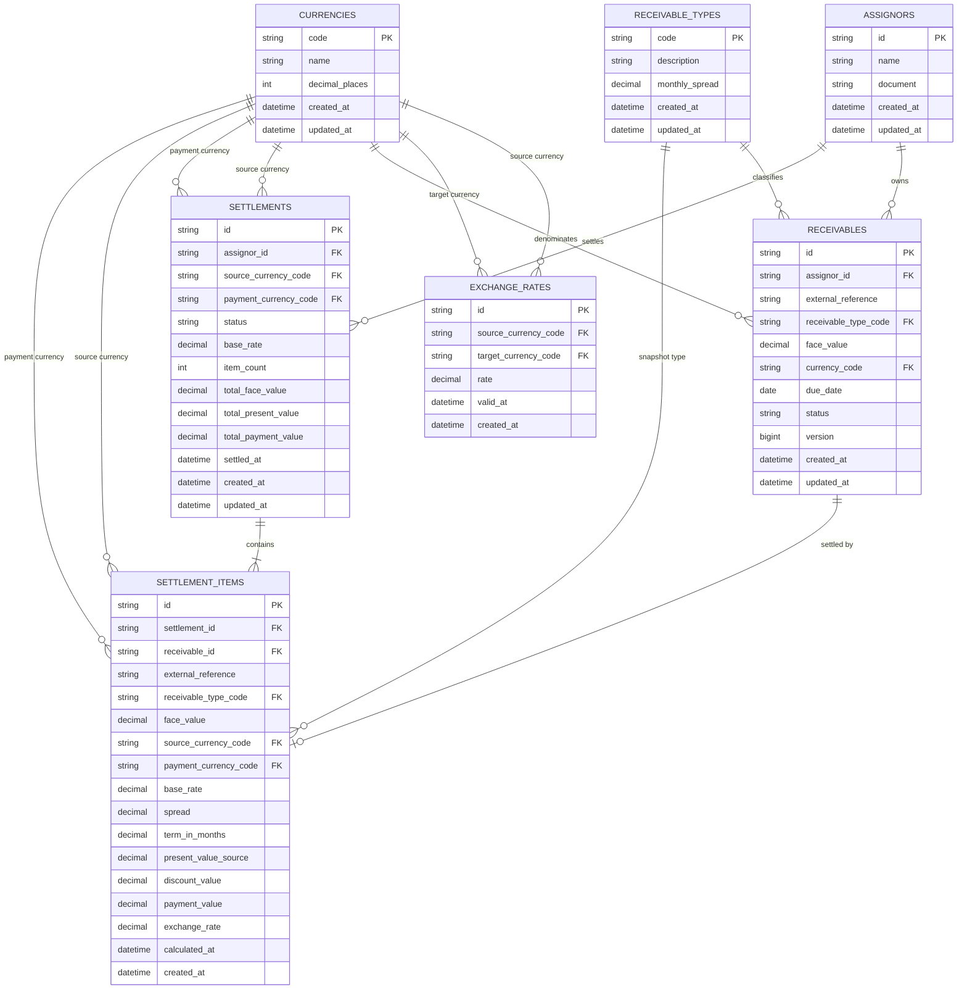

# ER Diagram - SRM Credit Engine

## 1. Purpose

This document defines the Entity Relationship Diagram for the **SRM Credit Engine** relational database.

The diagram represents the initial MySQL schema used by the application to support:

* supported currencies;
* supported receivable types;
* exchange-rate history;
* assignors;
* receivables;
* settlement batches;
* settlement item calculation snapshots;
* duplicate settlement prevention;
* analytical statement queries.

This diagram must remain aligned with:

```text
docs/specs/05-data-model.md
backend/src/main/resources/db/migration/*
```

## 2. Diagram



## 3. Entity Responsibilities

## 3.1 `currencies`

Stores supported currencies.

Initial records:

```text
BRL
USD
```

Primary responsibility:

* provide normalized currency references for receivables, settlements, settlement items and exchange rates.

Primary key:

```text
code
```

## 3.2 `receivable_types`

Stores supported receivable types and their reference monthly spreads.

Initial records:

```text
MERCANTILE_DUPLICATE = 0.01500000
POST_DATED_CHECK = 0.02500000
```

Primary responsibility:

* define supported receivable types;
* expose reference spreads;
* support reference-data APIs.

Primary key:

```text
code
```

## 3.3 `assignors`

Stores companies that assign or sell receivables.

Primary responsibility:

* identify the business entity associated with receivables and settlements.

Primary key:

```text
id
```

Important indexes:

```text
document
name
```

## 3.4 `exchange_rates`

Stores exchange rates between explicit currency pairs.

Primary responsibility:

* persist manual exchange rates;
* support latest-rate lookup by exact pair;
* preserve exchange-rate history.

Important rule:

```text
USD -> BRL is not the same pair as BRL -> USD.
```

If an exact pair is missing for a required cross-currency pricing or settlement operation, the failure must occur before settlement data is persisted.

Primary key:

```text
id
```

Foreign keys:

```text
source_currency_code -> currencies.code
target_currency_code -> currencies.code
```

Important index:

```text
source_currency_code, target_currency_code, valid_at DESC, created_at DESC
```

## 3.5 `receivables`

Stores receivables available for settlement.

Primary responsibility:

* represent the original credit asset before settlement;
* prevent duplicate business references per assignor;
* track settlement availability through status.

Primary key:

```text
id
```

Foreign keys:

```text
assignor_id -> assignors.id
receivable_type_code -> receivable_types.code
currency_code -> currencies.code
```

Important unique constraint:

```text
assignor_id, external_reference
```

Important statuses:

```text
AVAILABLE
SETTLED
CANCELLED
```

## 3.6 `settlements`

Stores settlement batch headers.

Primary responsibility:

* represent an atomic settlement batch;
* store settlement-level totals;
* expose the authoritative header-level source currency for the batch;
* support statement queries.

Primary key:

```text
id
```

Foreign keys:

```text
assignor_id -> assignors.id
source_currency_code -> currencies.code
payment_currency_code -> currencies.code
```

Important totals:

```text
total_face_value      in source_currency_code
total_present_value   in source_currency_code
total_payment_value   in payment_currency_code
```

Important assumption:

```text
All receivables in the same settlement batch must share the same source currency.
```

Important persisted rate rule:

```text
settlements.base_rate stores the effective base rate used by the backend
```

Resolution order:

```text
request baseRate -> DEFAULT_BASE_RATE fallback -> fail if neither exists
```

## 3.7 `settlement_items`

Stores item-level settlement calculation snapshots.

Primary responsibility:

* preserve auditable calculation inputs and outputs;
* prevent duplicate settlement of the same receivable;
* provide item-level detail for settlement review.

Primary key:

```text
id
```

Foreign keys:

```text
settlement_id -> settlements.id
receivable_id -> receivables.id
receivable_type_code -> receivable_types.code
source_currency_code -> currencies.code
payment_currency_code -> currencies.code
```

Important unique constraint:

```text
receivable_id
```

This prevents the same receivable from being settled more than once.

Important persisted rate rule:

```text
settlement_items.base_rate stores the effective base rate actually applied to the item
```

## 4. Cardinality Summary

## 4.1 Currency Relationships

```text
currencies 1 -> N exchange_rates as source currency
currencies 1 -> N exchange_rates as target currency
currencies 1 -> N receivables
currencies 1 -> N settlements as source currency
currencies 1 -> N settlements as payment currency
currencies 1 -> N settlement_items as source currency
currencies 1 -> N settlement_items as payment currency
```

## 4.2 Receivable Type Relationships

```text
receivable_types 1 -> N receivables
receivable_types 1 -> N settlement_items
```

## 4.3 Assignor Relationships

```text
assignors 1 -> N receivables
assignors 1 -> N settlements
```

## 4.4 Settlement Relationships

```text
settlements 1 -> N settlement_items
receivables 1 -> 0..1 settlement_items
```

The relationship between `receivables` and `settlement_items` is effectively one-to-zero-or-one because of:

```text
UNIQUE (receivable_id)
```

## 5. Critical Integrity Rules

## 5.1 Duplicate Settlement Prevention

A receivable must not be settled twice.

Database support:

```text
settlement_items.receivable_id is unique.
```

Application support:

```text
Only receivables with status AVAILABLE may be settled.
```

## 5.2 Settlement Atomicity

A settlement batch must be persisted atomically.

Expected behavior:

```text
If one item fails, no settlement header or settlement items are persisted.
```

This includes failures caused by:

```text
missing exchange rate
mixed source currency batch
missing effective base rate
```

Database design supports this through relational structure.

Application transaction boundary must exist in:

```text
CreateSettlementService
```

## 5.3 Historical Calculation Snapshot

`settlement_items` intentionally duplicates calculation data.

Snapshot fields include:

```text
external_reference
receivable_type_code
face_value
source_currency_code
payment_currency_code
base_rate
spread
term_in_months
present_value_source
discount_value
payment_value
exchange_rate
calculated_at
```

Reason:

```text
Historical settlements must remain explainable even when future exchange rates, spreads or rules change.
```

This includes the effective `base_rate` and the exact `exchange_rate` snapshot, when cross-currency conversion applies.

## 5.4 Exchange Rate Direction

Exchange rates are directional.

Valid examples:

```text
USD -> BRL
BRL -> USD
```

These must be stored and resolved independently.

The system must not silently invert exchange rates.

## 5.5 One Source Currency per Settlement

The initial model requires one source currency per settlement batch.

Reason:

```text
Settlement-level total_face_value and total_present_value are meaningful only in one source currency.
```

Cross-currency settlement remains supported:

```text
source_currency_code = BRL
payment_currency_code = USD
```

The header `source_currency_code` must match the common source currency represented by all related settlement items.

Mixed-source-currency batches are out of scope for the initial delivery.

## 6. Statement Query Support

The model supports analytical statement queries through:

```text
settlements
assignors
settlement_items
currencies
receivable_types
```

Required filters:

```text
period
assignor
source currency
payment currency
receivable type
settlement status
```

Important indexed columns:

```text
settlements.settled_at
settlements.assignor_id
settlements.source_currency_code
settlements.payment_currency_code
settlements.status
settlement_items.settlement_id
settlement_items.receivable_type_code
settlement_items.source_currency_code
settlement_items.payment_currency_code
```

Statement queries must use:

```text
database-level filtering
server-side pagination
deterministic sorting
```

Forbidden approach:

```text
Load all settlements into memory and filter in Java.
```

## 7. Data Model Notes

## 7.1 UUID Storage

The initial schema uses:

```text
CHAR(36)
```

for UUIDs.

Reason:

```text
Readable and simple for a technical challenge.
```

Future optimization:

```text
BINARY(16)
```

## 7.2 Monetary Precision

Monetary values use:

```text
DECIMAL(19, 4)
```

Rates and terms use:

```text
DECIMAL(19, 8)
```

Forbidden database types for financial values:

```text
FLOAT
DOUBLE
REAL
```

## 7.3 Timestamps

Timestamps use:

```text
DATETIME(6)
```

Application behavior:

```text
Store timestamps in UTC.
Expose API timestamps in ISO 8601 format.
```

## 7.4 Due Dates

Receivable due dates use:

```text
DATE
```

Reason:

```text
Due date is a date-only business field, not an instant.
```

## 8. Expected Flyway Alignment

The ER diagram must match the Flyway migrations.

Expected initial migration files:

```text
backend/src/main/resources/db/migration/V1__create_initial_schema.sql
backend/src/main/resources/db/migration/V2__seed_reference_data.sql
```

Expected `V1__create_initial_schema.sql` responsibilities:

```text
create tables
create primary keys
create foreign keys
create constraints
create indexes
```

Expected `V2__seed_reference_data.sql` responsibilities:

```text
seed currencies
seed receivable types
```

## 9. Future Model Enhancements

Potential future tables:

```text
base_rates
settlement_currency_totals
audit_events
users
roles
approval_workflows
exchange_rate_sources
settlement_status_history
outbox_events
```

These are intentionally out of scope for the initial delivery.

## 10. Validation Checklist

This diagram is valid if:

```text
[ ] All tables from docs/specs/05-data-model.md are represented.
[ ] All core foreign keys are represented.
[ ] Duplicate settlement prevention is represented.
[ ] Settlement item audit snapshot fields are represented.
[ ] Exchange-rate direction is represented.
[ ] One source currency per settlement is documented.
[ ] Diagram matches Flyway migrations.
[ ] Diagram matches API and business-rule assumptions.
```

## 11. Related Documents

```text
docs/specs/02-domain-glossary.md
docs/specs/03-business-rules.md
docs/specs/04-api-contract.md
docs/specs/05-data-model.md
docs/specs/06-architecture.md
docs/adr/ADR-002-database-choice.md
docs/adr/ADR-003-money-precision.md
```
